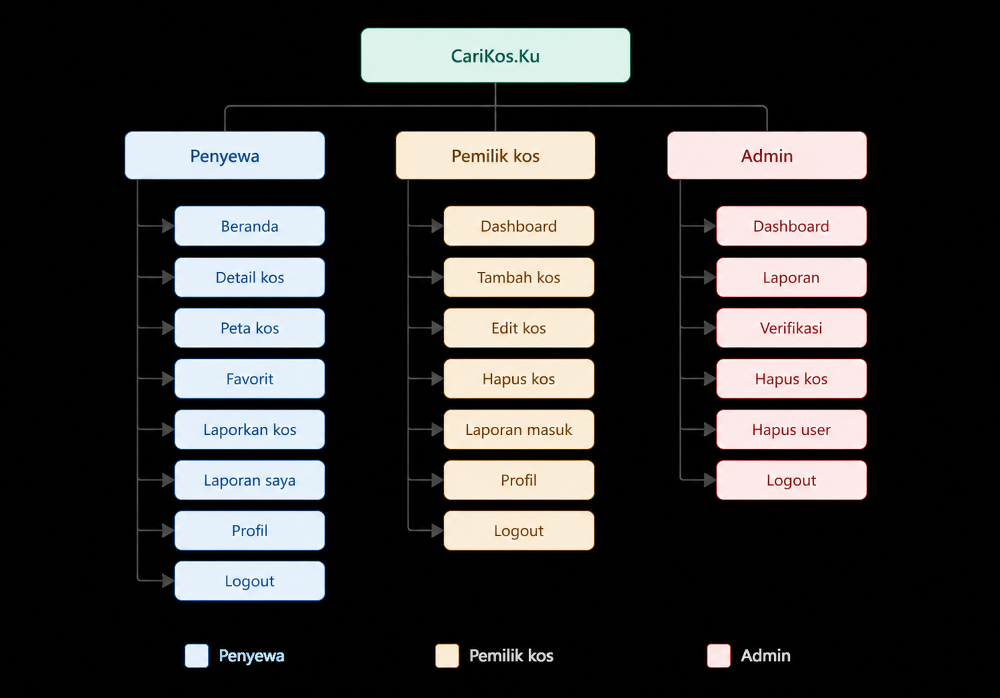
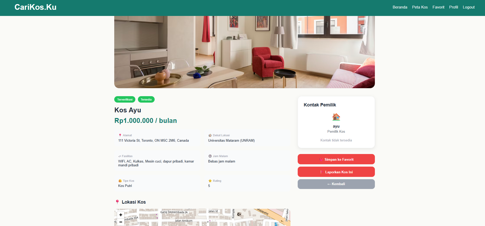
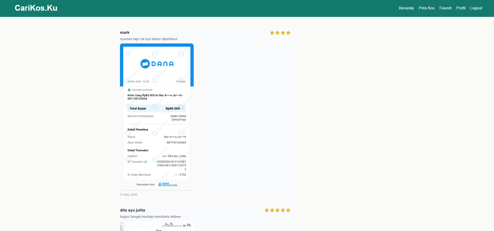
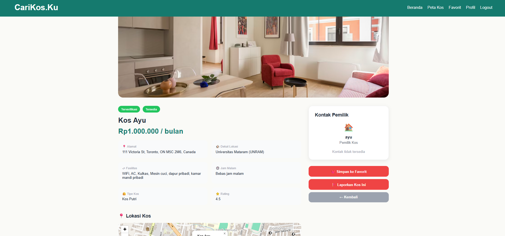
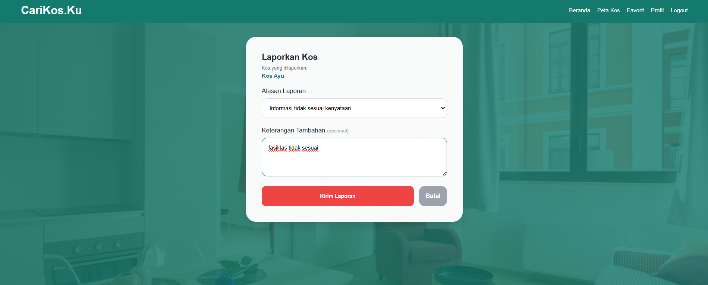
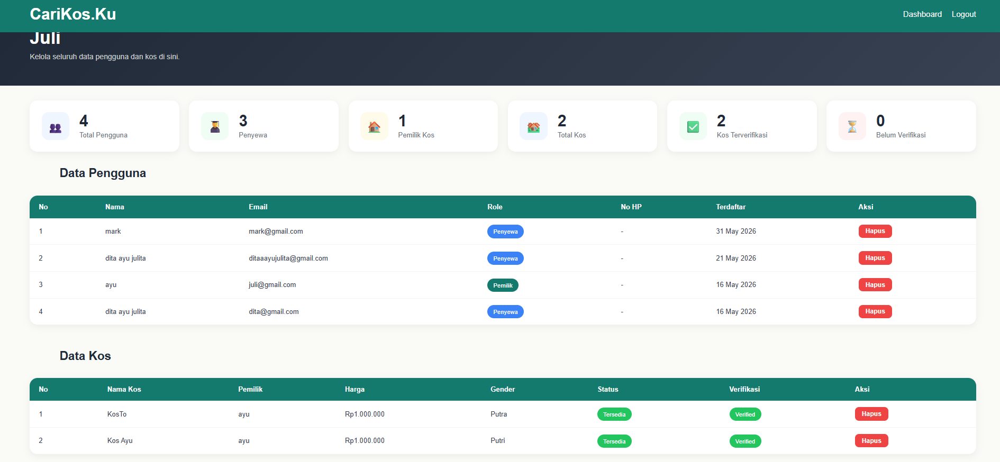
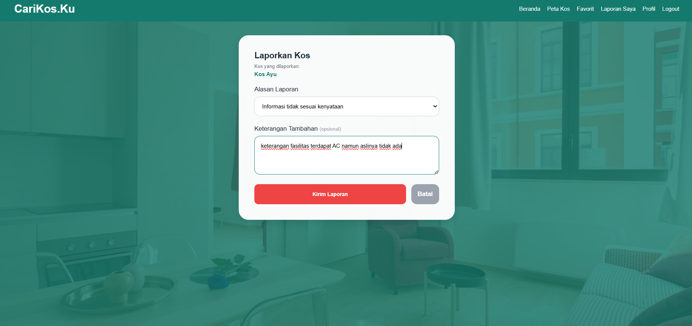
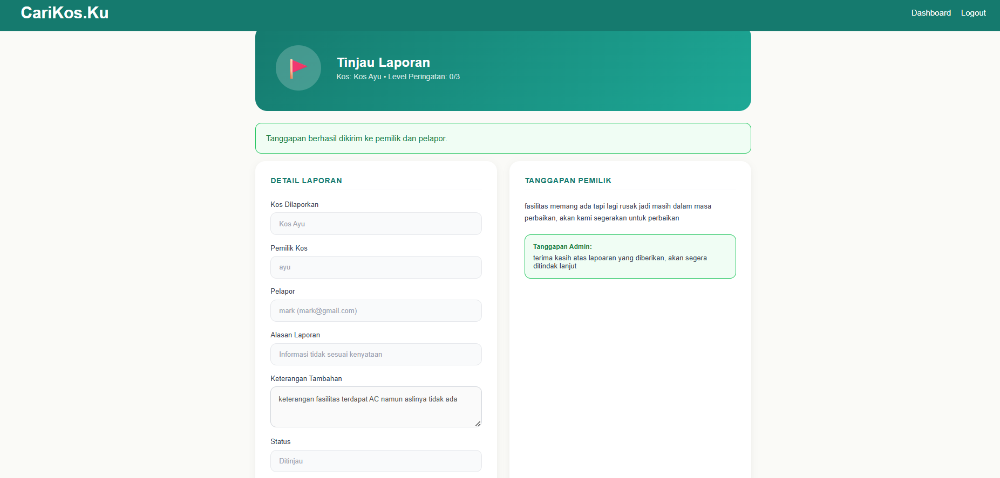
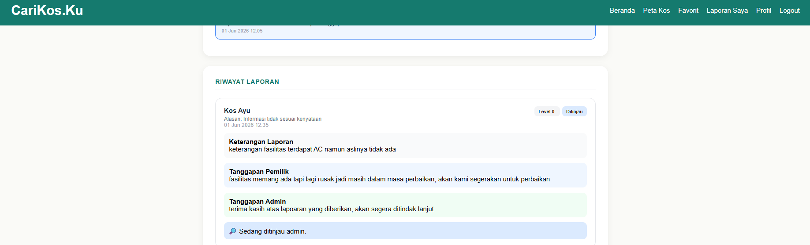

Nama website: CariKos.Ku
Deskripsi singkat: CariKos.Ku adalah platform web yang memudahkan mahasiswa mencari kos di sekitar kampus. Website ini menghubungkan penyewa (mahasiswa pencari kos) dengan pemilik kos, serta dilengkapi panel admin untuk memverifikasi dan mengelola data. Pengguna dapat mencari kos berdasarkan lokasi, harga, gender, dan fasilitas secara real-time. Dan pemilik kos dapat mengatur listing kos mereka.
Team role: 
- Dita Ayu Julita: Frontend Developer (Desain UI/UX, HTML, CSS, responsive layout, halaman login, register, dashboard)
- Fadila Rosidatul A'la: Database Administrator (Desain skema database, konfigurasi MySQL, spesifikasi tabel & relasi)
- Muhammad Zia Ul Haq: Backend Developer (Logic PHP, autentikasi, session management, routing antar halaman)
Site map: 
Aktor dan Fitur:
1. Penyewa 
- Register dan login akun
- Cari kos berdasarkan filter tertentu seperti lokasi, fasilitas, jam malam
- Menghubungi pemilik kos sesuai dengan kontak yang tertera
- Menyimpan kos ke favorit
- Menulis ulasan, rating kos, juga bisa menambahkan foto kos yang ingin diulas
- Melaporkan kos yang mencurigakan atau yang tidak sesuai dengan keterangan yang diberikan
- Melihat peta interaktif yang dapat menampilkan titik titik kos yang terdaftar
- Mengedit profile dan mengganti password
- Logout
2. Pemilik kos
- Register dan login akun
- Menambah listing kos baru (nama, alamat, lokasi, harga, dan keterangan lainnya)
- Edit informasi listing kos
- Hapus listing kos
- Lihat status verifikasi listing
- Mengedit profile dan mengganti password
- Melihat laporan kos yang masuk dan menanggapi, juga dapat melihat tanggapan admin
3. Admin
- Login dengan akun khusus
- Verifikasi listing kos yang diunggah pemilik
- Hapus listing kos yang melanggar ketentuan
- Hapus akun pengguna
- Pantau statistik platform (total pengguna, penyewa, pemilik, kos, terverifikasi, belum verifikasi)
- Melihat laporan yang masuk dari penyewa, melihat tanggapan pemilik, dan memberikan tanggapan serta keputusan
Tech Stack:
- Frontend: HTML, CSS, JavaScript
- Backend: PHP
- Database: MySQL
- Peta: Leaflet.js + OpenStreetMap
- Server: Apache (XAMPP)
Konfigurasi Database
Host: localhost
Username: root
Password: (default XAMPP)
Nama Database: carikosku
Spesifikasi tabel: 
1. Tabel users
Menyimpan data seluruh pengguna platform (penyewa, pemilik kos, dan admin).
id — INT, Primary Key, Auto Increment
nama — VARCHAR(100), nama lengkap pengguna
email — VARCHAR(100), Unique, email untuk login
password — VARCHAR(255), password terenkripsi MD5
role — ENUM (penyewa / pemilik)
no_hp — DEFAULT NULL, nomor HP/WhatsApp
created_at — TIMESTAMP, waktu registrasi
2. Tabel kos
Menyimpan data listing kos yang didaftarkan oleh pemilik kos.
id — INT, Primary Key, Auto Increment
user_id — INT, Foreign Key ke tabel users
nama_kos — VARCHAR(100), nama kos
alamat — TEXT, alamat lengkap kos
kampus_terdekat — VARCHAR(100), lokasi atau kampus terdekat
harga — INT, harga sewa per bulan dalam rupiah
gender — ENUM (putra / putri / campur)
fasilitas — TEXT, daftar fasilitas yang tersedia
jam_malam — VARCHAR(10), jam malam kos, nullable
status — ENUM (tersedia / hampir_penuh / penuh)
terverifikasi — TINYINT(1), 0 = belum terverifikasi, 1 = terverifikasi
rating — float DEFAULT 0, rata-rata rating dari ulasan
lat — DECIMAL(10,8), koordinat latitude untuk peta
lng — DECIMAL(11,8), koordinat longitude untuk peta
created_at — TIMESTAMP, waktu listing ditambahkan
Dokumen_kepemilikan (255)
3. Tabel kos_foto
Menyimpan foto-foto kos yang diupload oleh pemilik kos.
id — INT, Primary Key, Auto Increment
kos_id — INT, Foreign Key ke tabel kos
nama_file — VARCHAR(255), nama file foto yang tersimpan di folder uploads/
is_primary — TINYINT(1), 1 = foto utama yang ditampilkan di listing
created_at — DATETIME, waktu foto diupload
4. Tabel reviews
Menyimpan ulasan dan rating dari penyewa untuk setiap kos.
id — INT, Primary Key, Auto Increment
kos_id — INT, Foreign Key ke tabel kos
user_id — INT, Foreign Key ke tabel users
rating — INT (1-5), nilai rating yang diberikan
komentar — TEXT, isi ulasan
foto — VARCHAR(255), foto pendukung ulasan, nullable
created_at — DATETIME, waktu ulasan dikirim
5. Tabel favorites
Menyimpan data kos yang disimpan sebagai favorit oleh penyewa.
id — INT, Primary Key, Auto Increment
user_id — INT, Foreign Key ke tabel users
kos_id — INT, Foreign Key ke tabel kos
created_at — DATETIME, waktu kos disimpan ke favorit
6. Tabel reports
Menyimpan laporan dari penyewa terkait kos yang mencurigakan atau bermasalah.
id — INT, Primary Key, Auto Increment
reporter_id — INT, Foreign Key ke tabel users
kos_id — INT, Foreign Key ke tabel kos
alasan — VARCHAR(255), alasan laporan
keterangan — TEXT, keterangan tambahan dari pelapor, nullable
status — ENUM (pending / ditinjau / selesai), status penanganan laporan
created_at — DATETIME, waktu laporan dikirim
level_peringatan - int(11)
tanggapan_admin text
tanggapan_pemilik text
foto_tanggapan varchar(255) 
7. Tabel notifikasi
Menyimpan data notifikasi yang dikirim oleh sistem kepada pengguna terkait aktivitas pada platform, seperti status verifikasi kos, pembaruan laporan.
id - int(11), Auto_increment
user_id - int(11)
kos_id - int(11)
report_id - int(11)
pesan - text
tipe - enum ('peringatan', 'info', 'selesai')
is_read - tinyint(1)
created_at - DATETIME

BUG PROGRAM:
1. Bug: Rating yang ditampilkan pada detail kos hanya rating yang diberikan oleh user pertama. 
Gejala: Rating kos menampilkan angka 5 setelah 2 user memberikan rating 5 dan 4
Langkah reproduksi: Coba login sebagai 2 penyewa yang berbeda, masing-masing penyewa memberikan rating pada kos yang sama, lalu buka halaman detail kos
Hipotesis penyebab: Query UPDATE rating menggunakan dua langkah terpisah yaitu SELECT AVG ke variabel PHP, lalu UPDATE. Nilai AVG yang dihitung belum tentu menampilkan data terbaru
Fix: Ganti dua query terpisah menjadi satu UPDATE dengan subquery UPDATE kos SET rating = (SELECT ROUND(AVG(r.rating),2) FROM reviews r WHERE r.kos_id='$id') WHERE id='$id'
Bukti screenshot:
- 
- 
- 

2. Bug: Laporan yang diberikan oleh penyewa hilang begitu saja, tidak bisa diproses oleh admin atau dilihat oleh pemilik kos
Gejala: Penyewa sudah submit laporan, tapi di dashboard admin tidak ada tampilan yang memperlihatkan adanya laporan yang masuk. Pada dashboard pemilik juga seperti itu, jadi laporan yang diberikan oleh penyewa tidak bisa ditindak lanjut. Penyewa jadi tidak tahu laporannya ditindak lanjuti atau tidak.
Langkah reproduksi: Login sebagai penyewa lalu buka detail kos dan klik laporan, isi form laporan dan submit. Buka page pemilik, tidak ada laporan yang muncul. Lalu buka page admin dan di sana tidak ada tampilan laporan masuk.
Hipotesis penyebab: Sistem hanya menyimpan data laporan ke tabel reports saja tanpa menampilkan data pada dashboard admin dan pemilik. File index_admin.php belum memiliki query untuk mengambil data dari tabel reports. Belum ada page khusus untuk meninjau laporan, belum ada juga mekanisme untuk pemilik kos untuk melihat dan memberikan tanggapan. Belum ada notifikasi untuk menghubungkan proses laporan antara penyewa, pemilik, dan admin.
Fix: Menambahkan query SELECT reports JOIN users JOIN kos di dashboard admin untuk menampilkan daftar laporan yang masuk, membuat halaman laporan_admin.php untuk proses peninjauan laporan oleh admin, menambahkan halaman laporan_pemilik.php agar pemilik kos dapat melihat dan memberikan tanggapan terhadap laporan yang diterima, menambahkan tabel notifikasi untuk mendukung sistem pemberitahuan, mengimplementasikan pengiriman notifikasi secara otomatis saat laporan dibuat, saat pemilik memberikan tanggapan, dan saat admin memberikan keputusan. Membuat halaman laporan_penyewa.php agar penyewa dapat memantau perkembangan laporan, melihat tanggapan pemilik kos, dan mengetahui hasil keputusan admin.
Bukti screenshot:
- 
- 
- 
- 
- 

AI usage statement 
1) tool: claude.ai dan ChatGPT.ai
2) untuk apa: logika untuk kode, perkembangan map, brainstorming struktur fitur. Lebih banyak itu biasanya logika kode untuk peta, karena sistem ini butuh peta, bingung biar bisa masukin peta nya bagaimana.
3) 2-3 promt utama:
- Saya mau tambahkan peta interaktif di halaman pencarian kos dan di form tambah kos. Pemilik kos bisa klik titik di peta untuk menentukan lokasi kos mereka, dan koordinatnya otomatis terisi ke input. Bagaimana caranya?"
- "Laporan dari penyewa tersimpan di database tapi gak muncul di dashboard admin dan gak bisa dilihat pemilik kos. Bagaimana cara membuat sistem laporan yang lengkap dengan notifikasi antar pihak?"
4) bagian output AI yang dipakai:
- Integrasi Leaflet.js untuk peta interaktif 
- Struktur dasar file laporan admin dan pemilik yang disesuaikan juga dengan database. 
5) bagian yang saya ubah + alasan:
- Koordinat default disesuaikan ke pusat Kota Mataram (-8.5833, 116.1167) AI menggunakan koordinat generik, disesuaikan ke lokasi target pengguna. Karena sistem ini butuh peta interaktif, yang pemiliknya itu gak perlu susah pikir longtitude latitude nya, jadi titik kos bisa langsung diklik dan longtitude latitude bisa otomatis terdeteksi.
- Bagian laporan admin, pemilik dan juga penyewa. Karena admin harus bisa melihat juga laporan dari penyewa dan mengambil tindakan yang sesuai. Pemilik juga harus melihat untuk dijadikan evaluasi dan memberikan tanggapan