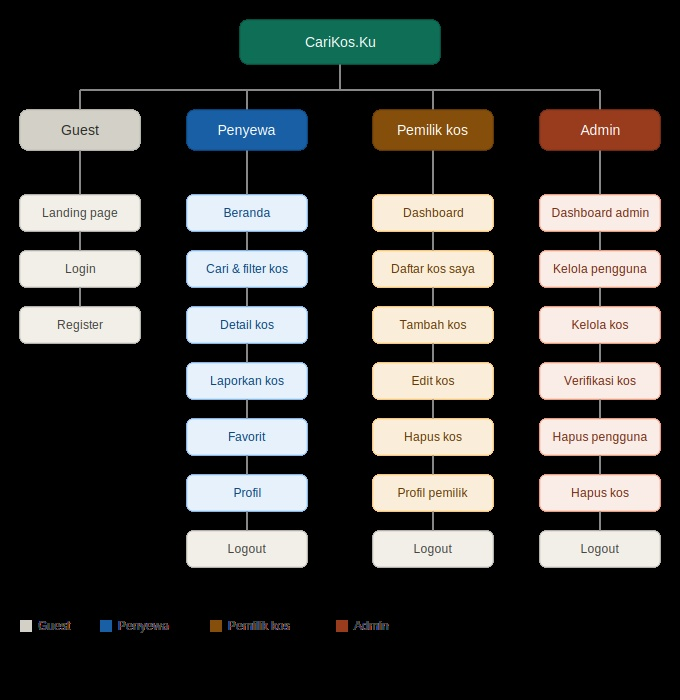

Nama website: CariKos.Ku
Deskripsi singkat: CariKos.Ku adalah platform web yang memudahkan mahasiswa mencari kos di sekitar kampus. Website ini menghubungkan penyewa (mahasiswa pencari kos) dengan pemilik kos, serta dilengkapi panel admin untuk memverifikasi dan mengelola data. Pengguna dapat mencari kos berdasarkan lokasi, harga, gender, dan fasilitas secara real-time. Dan pemilik kos dapat mengatur listing kos mereka.
Team role: 
- Dita Ayu Julita: Frontend Developer (Desain UI/UX, HTML, CSS, responsive layout, halaman login, register, dashboard)
- Fadila Rosidatul A'la: Database Administrator (Desain skema database, konfigurasi MySQL, spesifikasi tabel & relasi)
- Muhammad Zia Ul Haq: Backend Developer (Logic PHP, autentikasi, session management, routing antar halaman)
Site map: 
Aktor dan Fitur:
1. Penyewa 
- Register dan login akun
- Cari kos berdasarkan filter tertentu seperti lokasi, fasilitas, jam malam
- Menghubungi pemilik kos sesuai dengan kontak yang tertera
- Menyimpan kos ke favorit
- Menulis ulasan, rating kos, juga bisa menambahkan foto kos yang ingin diulas
- Melaporkan kos yang mencurigakan atau yang tidak sesuai dengan keterangan yang diberikan
- Melihat peta interaktif yang dapat menampilkan titik titik kos yang terdaftar
- Mengedit profile dan mengganti password
2. Pemilik kos
- Register dan login akun
- Menambah listing kos baru (nama, alamat, lokasi, harga, dan keterangan lainnya)
- Edit informasi listing kos
- Hapus listing kos
- Lihat status verifikasi listing
- Mengedit profile dan mengganti password
3. Admin
- Login dengan akun khusus
- Verifikasi listing kos yang diunggah pemilik
- Hapus listing kos yang melanggar ketentuan
- Hapus akun pengguna
- Pantau statistik platform (total pengguna, penyewa, pemilik, kos, terverifikasi, belum verifikasi)
Tech Stack:
- Frontend: HTML, CSS, JavaScript
- Backend: PHP
- Database: MySQL
- Peta: Leaflet.js + OpenStreetMap
- Server: Apache (XAMPP)
Konfigurasi Database
Host: localhost
Username: root
Password: (default XAMPP)
Nama Database: carikosku
Spesifikasi tabel: 
1. Tabel users
Menyimpan data seluruh pengguna platform (penyewa, pemilik kos, dan admin).
id — INT, Primary Key, Auto Increment
nama — VARCHAR(100), nama lengkap pengguna
email — VARCHAR(100), Unique, email untuk login
password — VARCHAR(255), password terenkripsi MD5
role — ENUM (penyewa / pemilik / admin)
no_hp — VARCHAR(20), nomor HP/WhatsApp
created_at — DATETIME, waktu registrasi
2. Tabel kos
Menyimpan data listing kos yang didaftarkan oleh pemilik kos.
id — INT, Primary Key, Auto Increment
user_id — INT, Foreign Key ke tabel users
nama_kos — VARCHAR(150), nama kos
alamat — TEXT, alamat lengkap kos
kampus_terdekat — VARCHAR(100), lokasi atau kampus terdekat
harga — INT, harga sewa per bulan dalam rupiah
gender — ENUM (putra / putri / campur)
fasilitas — TEXT, daftar fasilitas yang tersedia
jam_malam — VARCHAR(20), jam malam kos, nullable
status — ENUM (tersedia / hampir_penuh / penuh)
terverifikasi — TINYINT(1), 0 = belum terverifikasi, 1 = terverifikasi
rating — DECIMAL(3,1), rata-rata rating dari ulasan
lat — DECIMAL(10,8), koordinat latitude untuk peta
lng — DECIMAL(11,8), koordinat longitude untuk peta
created_at — DATETIME, waktu listing ditambahkan
3. Tabel kos_foto
Menyimpan foto-foto kos yang diupload oleh pemilik kos.
id — INT, Primary Key, Auto Increment
kos_id — INT, Foreign Key ke tabel kos
nama_file — VARCHAR(255), nama file foto yang tersimpan di folder uploads/
is_primary — TINYINT(1), 1 = foto utama yang ditampilkan di listing
created_at — DATETIME, waktu foto diupload
4. Tabel reviews
Menyimpan ulasan dan rating dari penyewa untuk setiap kos.
id — INT, Primary Key, Auto Increment
kos_id — INT, Foreign Key ke tabel kos
user_id — INT, Foreign Key ke tabel users
rating — INT (1-5), nilai rating yang diberikan
komentar — TEXT, isi ulasan
foto — VARCHAR(255), foto pendukung ulasan, nullable
created_at — DATETIME, waktu ulasan dikirim
5. Tabel favorites
Menyimpan data kos yang disimpan sebagai favorit oleh penyewa.
id — INT, Primary Key, Auto Increment
user_id — INT, Foreign Key ke tabel users
kos_id — INT, Foreign Key ke tabel kos
created_at — DATETIME, waktu kos disimpan ke favorit
6. Tabel reports
Menyimpan laporan dari penyewa terkait kos yang mencurigakan atau bermasalah.
id — INT, Primary Key, Auto Increment
reporter_id — INT, Foreign Key ke tabel users
kos_id — INT, Foreign Key ke tabel kos
alasan — VARCHAR(255), alasan laporan
keterangan — TEXT, keterangan tambahan dari pelapor, nullable
status — ENUM (pending / ditinjau / selesai), status penanganan laporan
created_at — DATETIME, waktu laporan dikirim